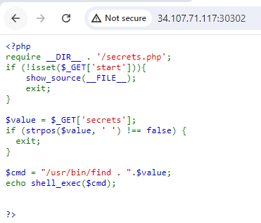
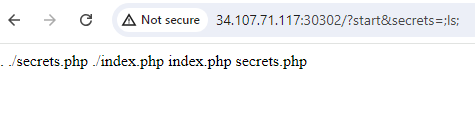
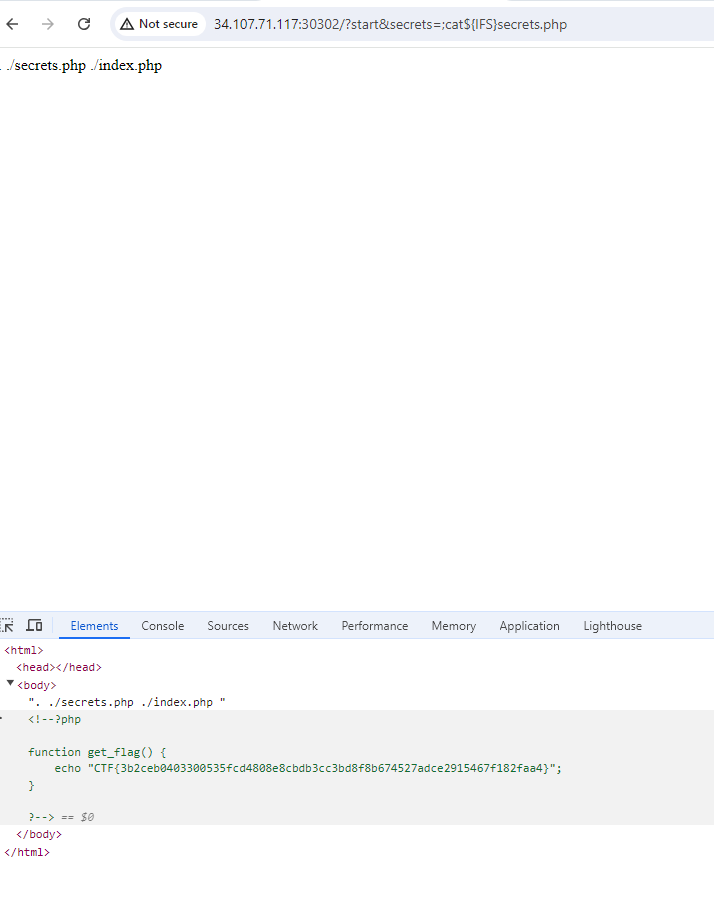

# Blacklisting
## Description: I think my blacklist is going to prevent any vulnerability!
### We are given the code of a PHP app. There is a filter which we need to bypass and execute some command to get the flag.

 
  

### The strpos function verifies if we have space in our input. Also we need to escape from the find command. We can do that by appending ‘;’. So, until now we can run one word commands, like:

http://34.107.71.117:30302/?start&secrets=;ls;

 
  

### Knowing space is not allowed, we should try something else instead of it. After some research, I found this link: 

https://unix.stackexchange.com/questions/351331/how-to-send-a-command-with-arguments-without-spaces

### from which we can find that ${IFS} can be used instead of space. We try this:

http://34.107.71.117:30302/?start&secrets=;cat{$IFS}secrets.php;

### And we got the flag!!!!!

 
  

